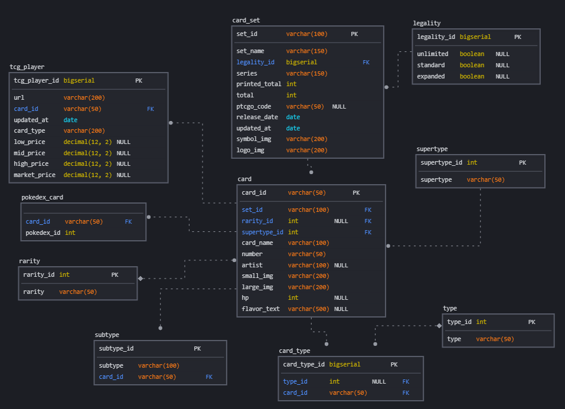

# Poke TCG DB - Web database on your favourite Pokemon TCG Cards!

## About
Poke TCG DB is a web application made to conveniently access all the information you need on Pokemon TCG Cards at one place. Get the latest cards, card sets and prices from [TCGPlayer](https://www.tcgplayer.com/)! Started this project to learn more about full stack development and SQL in particular.

## Frameworks / Libraries used

| Framework    | Function                                                      |
| ----------   | ------------------------------------------------------------- | 
| Next.js      | Frontend framework to display data to users |
| axios      | HTTP requests to backend server |
| MUI      | Prebuilt form components |
| TailwindCSS      | CSS styling and color palettes |
| formik     | Form handling |
| Express.js     | Backend framework to serve HTTP requests and routing |
| pokemontcgsdk    | Node.js wrapper around Pokemon TCG API |
| PostgreSQL     | Relational Database |
| Vercel     | Host frontend service |
| Heroku     | Host backend service |

## How it works
- Frontend and Backend connects through REST APIs.
- Backend queries cloud Postgres database on request hit.
- Gets data and runs through middleware
- Outputs JSON to Next.js app.
- Next.js parses JSON and serves to end user.

## ER Diagram
### Made using [SqlDBM](https://sqldbm.com/Home/) 


## API routes
### Card
| Type    | Route | Description |
| ----------   | -------- | -------- | 
| `GET`    | `/api/cards/all` | Get all cards from database. |
| `GET`    | `/api/cards/set/:set` | Get all cards from database by specific set_id. |
| `GET`    | `/api/cards/type/<type>?quantity=<qty>` | Get all cards from database that matches type with specific quantity. |
| `GET`    | `/api/cards/:card_id` | Get card from database by card_id. 
| `GET`    | `/api/cards/all?quantity=<qty>` | Get all cards from database with specific quantity. Ordered by latest released cards. |
| `GET`    | `/api/cards/count` | Get total card count from database.|
| `GET`    | `/api/cards/search?card_name=<card_name>&set_id=<set_id>&type_id=<type_id>&supertype_id=<supertype_id>&rarity_id=<rarity_id>` | Search for card in database. card_name param is required. |

### Set
| Type    | Route | Description |
| ----------   | -------- | -------- | 
| `GET`    | `/api/sets/all` | Get all card sets from database. |
| `GET`    | `/api/sets/id/:id` | Get set from database by set_id. |
| `GET`    | `/api/sets/count` | Get total card set count from database.|

### Types
| Type    | Route | Description |
| ----------   | -------- | -------- | 
| `GET`    | `/api/types/all` | Get all pokemon types from database. |

### Supertypes
| Type    | Route | Description |
| ----------   | -------- | -------- | 
| `GET`    | `/api/supertypes/all` | Get all supertypes from database. |

### Rarities
| Type    | Route | Description |
| ----------   | -------- | -------- | 
| `GET`    | `/api/rarities/all` | Get all rarities from database. |

## Installation
- Register for Pokemon TCG API key from [Pokemon TCG API](https://pokemontcg.io/)
- Clone from github
- Run `npm install` in `/src` and `/src/client` directory to install both frontend and backend.
- Create `.env` file, put in root directory. Env file contents will be put below.
- Install PostgreSQL on your local machine.
- Create Postgres User 
- Run `sql/createDatabase.pgsql`
- `\connect poke-tcg-db`
- Run `sql/createTables.pgsql`
- Run `src/scripts/seed.py` 
- If seed sucessful, installation is complete.
- Else, run `sql/cleanTables.pgsql` to reset database.
- Repeat seeding database til sucessful.
- Run both apps on seperate on the terminal by `npm run dev`
- Go to http://localhost:5000, next app will be displayed

## Env file contents
Create `.env` file, put in root directory. Contents:
```
PG_USER=<your postgres username>
PG_PASSWORD=<your postgres password>
PG_HOST=localhost
PG_PORT=<your postgres port number>
PG_DATABASE=poke-tcg-db

POKE_API_TCG_KEY=<your Pokemon TCG API key>

NEXT_APP_URL_LOCAL=http://localhost:5000
NEXT_APP_URL=<your Vercel domain if you decide to host>
```

## Special thanks
- [Pokemon TCG API](https://pokemontcg.io/)
- [duiker101](https://github.com/duiker101/) - [Pokemon Type SVG Icons](https://github.com/duiker101/pokemon-type-svg-icons)
- [jnovack](https://github.com/jnovack/) - [Pokemon SVG Icons](https://github.com/jnovack/pokemon-svg)


